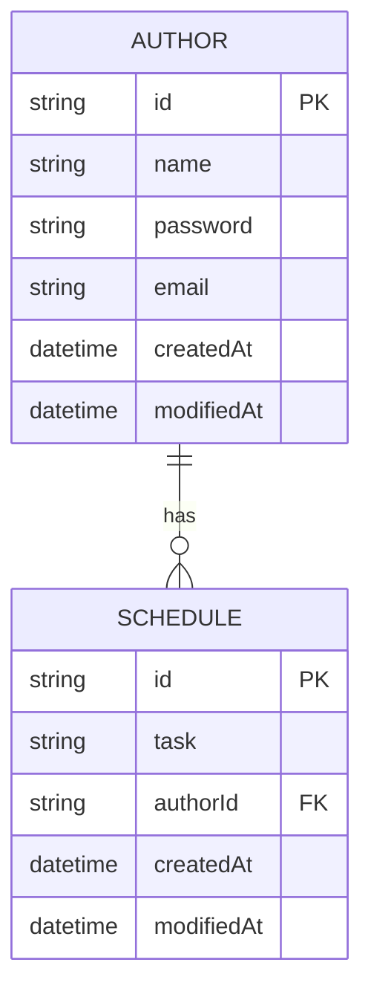

# ScheduleApp API Documentation

This is a Spring Boot application built to handle schedules with multiple API versions. The application uses **Lombok**, **JDBC**, and an **H2 in-memory database**.

---

## **How to Run the Server**
1. Start the Spring Boot application.
2. APIs are accessible through `/api/v1`, `/api/v2`, ..., `/api/v5`, where each version corresponds to a specific level of API functionality. (Since an in-memory database is used, all levels of APIs are designed to run within a single application execution.)
3. Visit `/` in your browser to access the **H2 database workbench**.

---

## **H2 Database Configuration**
The necessary database connection details are located in the `application.properties` file. Use this file to:
- Access the H2 workbench.
- Configure database settings if needed.

---

## **Project Structure**

### **Main Directory Structure**
```plaintext
src
├── main
│   ├── java
│   │   └── org.example.scheduleapp
│   │       ├── controller      # Common controllers
│   │       ├── entity          # Shared entity definitions
│   │       ├── v1              # API version 1 (Level 1)
│   │       ├── v2              # API version 2 (Level 2)
│   │       ├── v3              # API version 3 (Level 3)
│   │       ├── v4              # API version 4 (Level 4)
│   │       ├── v5              # API version 5 (Level 5)
│   │       └── v6              # Placeholder for future levels
│   ├── resources
│   │   ├── static              # Static resources
│   │   ├── templates           # Template files
│   │   ├── application.properties # Configuration file
│   │   └── schema.sql          # SQL schema for initialization

```
### **Version-Specific Directories**
Each version (`v1`, `v2`, ..., `v5`) includes the following components:

- **Controller**: Handles HTTP requests and routes them to services.
- **Service**: Contains business logic for API operations.
- **Repository**: Handles database interactions.
- **DTO**: Defines data transfer objects for API requests and responses.


### **Shared Entities**
The `entity` package contains shared entity classes that are used across all API versions.

---
# ER Diagram


---
# API Specification

## Level 1: Create/Read
### Post Schedule
```javascript
POST /api/v1/schedules
{
  "task": "string",
  "authorName": "string",
  "password": "string"
}

Response 200
{
  "id": "string",
  "task": "string",
  "authorId": "string",
  "authorName": "string",
  "createdAt": "datetime",
  "modifiedAt": "datetime"
}
```

### Get All Schedules
```javascript
GET /api/v1/schedules?modifiedAt={YYYY-MM-DD}&authorName={authorName}

Response 200
[
  {
    "id": "string",
    "task": "string",
    "authorId": "string", 
    "authorName": "string",
    "createdAt": "datetime",
    "modifiedAt": "datetime"
  }
]
```

### Get Schedule by Schedule ID
```javascript
GET /api/v1/schedules/{id}

Response 200
{
  "id": "string",
  "task": "string",
  "authorId": "string",
  "authorName": "string",
  "createdAt": "datetime", 
  "modifiedAt": "datetime"
}
```

## Level 2: Update/Delete
### Patch Schedule
```javascript
PATCH /api/v2/schedules/{id}
{
  "task": "string",
  "authorName": "string",
  "password": "string"
}

Response 200
{
  "id": "string",
  "task": "string",
  "authorId": "string",
  "authorName": "string",
  "createdAt": "datetime",
  "modifiedAt": "datetime"
}
```

### Delete Schedule
```javascript
DELETE /api/v2/schedules/{id}
{
  "password": "string"
}

Response 204
```

## Level 3: User Management
### Patch Email
```javascript
PATCH /api/v3/authors/email
{
  "authorName": "string",
  "password": "string",
  "email": "string"
}

Response 200
{
  "id": "string",
  "name": "string",
  "email": "string",
  "createdAt": "datetime",
  "modifiedAt": "datetime"
}
```

### Get Schedules by Author ID
```javascript
GET /api/v3/authors/{authorId}/schedules

Response 200
[
  {
    "id": "string",
    "task": "string",
    "authorId": "string",
    "authorName": "string",
    "createdAt": "datetime",
    "modifiedAt": "datetime"
  }
]
```
## Level 4: Paging
### Get All Schedules with Paging
```javascript
GET /api/v1/schedules?modifiedAt={YYYY-MM-DD}&authorName={authorName}&page={page}&size={size}

Response 200
[
  {
    "id": "string",
    "task": "string",
    "authorId": "string", 
    "authorName": "string",
    "createdAt": "datetime",
    "modifiedAt": "datetime"
  }
]
```
## Level 5: Exception Handling
### **Get Schedule by Schedule ID**
**Endpoint**: `GET /api/v5/schedules/{id}`

#### Possible Exceptions
1. **Schedule Not Found**
    - **Condition**: When the specified `id` does not match any existing schedule.
    - **HTTP Status Code**: `404 Not Found`
    - **Error Message**:
      ```json
      {
        "timestamp": "datetime",
        "status": 404,
        "message": "Schedule not found with id: {id}"
      }
      ```

---

### **Patch Schedule**
**Endpoint**: `PATCH /api/v5/schedules/{id}`

#### Possible Exceptions
1. **Schedule Not Found**
    - **Condition**: When the specified `id` does not match any existing schedule.
    - **HTTP Status Code**: `404 Not Found`
    - **Error Message**:
      ```json
      {
        "timestamp": "datetime",
        "status": 404,
        "message": "Schedule not found with id: {id}"
      }
      ```

2. **Invalid Password**
    - **Condition**: When the provided `password` does not match the schedule's author password.
    - **HTTP Status Code**: `401 Unauthorized`
    - **Error Message**:
      ```json
      {
        "timestamp": "datetime",
        "status": 401,
        "message": "Invalid password"
      }
      ```

---

### **Delete Schedule**
**Endpoint**: `DELETE /api/v5/schedules/{id}`

#### Possible Exceptions
1. **Schedule Not Found**
    - **Condition**: When the specified `id` does not match any existing schedule.
    - **HTTP Status Code**: `404 Not Found`
    - **Error Message**:
      ```json
      {
        "timestamp": "datetime",
        "status": 404,
        "message": "Schedule not found with id: {id}"
      }
      ```

2. **Invalid Password**
    - **Condition**: When the provided `password` does not match the schedule's author password.
    - **HTTP Status Code**: `401 Unauthorized`
    - **Error Message**:
      ```json
      {
        "timestamp": "datetime",
        "status": 401,
        "message": "Invalid password"
      }
      ```
## Level 6: Validaton
### **In Progress..**
