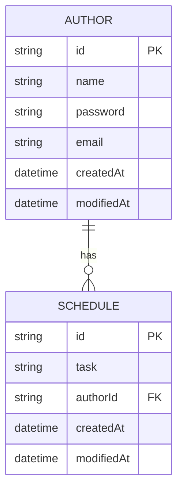

# Schedule App

---
# ER Diagram


---
# API Specification

## Level 1: Create/Read
### Post Schedule
```javascript
POST /api/v1/schedules
{
  "task": "string",
  "authorName": "string",
  "password": "string"
}

Response 200
{
  "id": "string",
  "task": "string",
  "authorId": "string",
  "authorName": "string",
  "createdAt": "datetime",
  "modifiedAt": "datetime"
}
```

### Get All Schedules
```javascript
GET /api/v1/schedules?modifiedAt={YYYY-MM-DD}&authorName={authorName}

Response 200
[
  {
    "id": "string",
    "task": "string",
    "authorId": "string", 
    "authorName": "string",
    "createdAt": "datetime",
    "modifiedAt": "datetime"
  }
]
```

### Get Schedule by Schedule ID
```javascript
GET /api/v1/schedules/{id}

Response 200
{
  "id": "string",
  "task": "string",
  "authorId": "string",
  "authorName": "string",
  "createdAt": "datetime", 
  "modifiedAt": "datetime"
}
```

## Level 2: Update/Delete
### Patch Schedule
```javascript
PATCH /api/v2/schedules/{id}
{
  "task": "string",
  "authorName": "string",
  "password": "string"
}

Response 200
{
  "id": "string",
  "task": "string",
  "authorId": "string",
  "authorName": "string",
  "createdAt": "datetime",
  "modifiedAt": "datetime"
}
```

### Delete Schedule
```javascript
DELETE /api/v2/schedules/{id}
{
  "password": "string"
}

Response 204
```

## Level 3: User Management
### Patch Email
```javascript
PATCH /api/v3/authors/email
{
  "authorName": "string",
  "password": "string",
  "email": "string"
}

Response 200
{
  "id": "string",
  "name": "string",
  "email": "string",
  "createdAt": "datetime",
  "modifiedAt": "datetime"
}
```

### Get Schedules by Author ID
```javascript
GET /api/v3/authors/{authorId}/schedules

Response 200
[
  {
    "id": "string",
    "task": "string",
    "authorId": "string",
    "authorName": "string",
    "createdAt": "datetime",
    "modifiedAt": "datetime"
  }
]
```
## Level 4: Paging
### Get All Schedules with Paging
```javascript
GET /api/v1/schedules?modifiedAt={YYYY-MM-DD}&authorName={authorName}&page={page}&size={size}

Response 200
[
  {
    "id": "string",
    "task": "string",
    "authorId": "string", 
    "authorName": "string",
    "createdAt": "datetime",
    "modifiedAt": "datetime"
  }
]
```
## Level 5: Exception Handling
### **Get Schedule by Schedule ID**
**Endpoint**: `GET /api/v5/schedules/{id}`

#### Possible Exceptions
1. **Schedule Not Found**
    - **Condition**: When the specified `id` does not match any existing schedule.
    - **HTTP Status Code**: `404 Not Found`
    - **Error Message**:
      ```json
      {
        "timestamp": "datetime",
        "status": 404,
        "message": "Schedule not found with id: {id}"
      }
      ```

---

### **Patch Schedule**
**Endpoint**: `PATCH /api/v5/schedules/{id}`

#### Possible Exceptions
1. **Schedule Not Found**
    - **Condition**: When the specified `id` does not match any existing schedule.
    - **HTTP Status Code**: `404 Not Found`
    - **Error Message**:
      ```json
      {
        "timestamp": "datetime",
        "status": 404,
        "message": "Schedule not found with id: {id}"
      }
      ```

2. **Invalid Password**
    - **Condition**: When the provided `password` does not match the schedule's author password.
    - **HTTP Status Code**: `401 Unauthorized`
    - **Error Message**:
      ```json
      {
        "timestamp": "datetime",
        "status": 401,
        "message": "Invalid password"
      }
      ```

---

### **Delete Schedule**
**Endpoint**: `DELETE /api/v5/schedules/{id}`

#### Possible Exceptions
1. **Schedule Not Found**
    - **Condition**: When the specified `id` does not match any existing schedule.
    - **HTTP Status Code**: `404 Not Found`
    - **Error Message**:
      ```json
      {
        "timestamp": "datetime",
        "status": 404,
        "message": "Schedule not found with id: {id}"
      }
      ```

2. **Invalid Password**
    - **Condition**: When the provided `password` does not match the schedule's author password.
    - **HTTP Status Code**: `401 Unauthorized`
    - **Error Message**:
      ```json
      {
        "timestamp": "datetime",
        "status": 401,
        "message": "Invalid password"
      }
      ```
