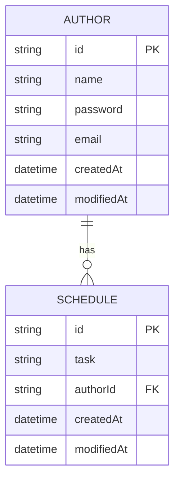

# To-do List API

## Level 1: Create/Read
### Post Schedule
```javascript
POST /api/schedules
{
  "task": "string",
  "authorName": "string",
  "password": "string"
}

Response 200
{
  "id": "string",
  "task": "string",
  "authorId": "string",
  "authorName": "string",
  "createdAt": "datetime",
  "modifiedAt": "datetime"
}
```

### Get All Schedules
```javascript
GET /api/schedules?modifiedAt={YYYY-MM-DD}&authorName={authorName}

Response 200
[
  {
    "id": "string",
    "task": "string",
    "authorId": "string", 
    "authorName": "string",
    "createdAt": "datetime",
    "modifiedAt": "datetime"
  }
]
```

### Get Schedule by Schedule ID
```javascript
GET /api/schedules/{id}

Response 200
{
  "id": "string",
  "task": "string",
  "authorId": "string",
  "authorName": "string",
  "createdAt": "datetime", 
  "modifiedAt": "datetime"
}
```

## Level 2: Update/Delete
### Patch Schedule
```javascript
PATCH /api/schedules/{id}
{
  "task": "string",
  "authorName": "string",
  "password": "string"
}

Response 200
{
  "id": "string",
  "task": "string",
  "authorId": "string",
  "authorName": "string",
  "createdAt": "datetime",
  "modifiedAt": "datetime"
}
```

### Delete Schedule
```javascript
DELETE /api/schedules/{id}
{
  "password": "string"
}

Response 204
```

## Level 3: User Management
### Patch Email
```javascript
PATCH /api/authors/email
{
  "authorName": "string",
  "password": "string",
  "email": "string"
}

Response 200
{
  "id": "string",
  "name": "string",
  "email": "string",
  "createdAt": "datetime",
  "modifiedAt": "datetime"
}
```

### Get Schedules by Author ID
```javascript
GET /api/authors/{authorId}/schedules

Response 200
[
  {
    "id": "string",
    "task": "string",
    "authorId": "string",
    "authorName": "string",
    "createdAt": "datetime",
    "modifiedAt": "datetime"
  }
]
```
---
# ER Diagram

